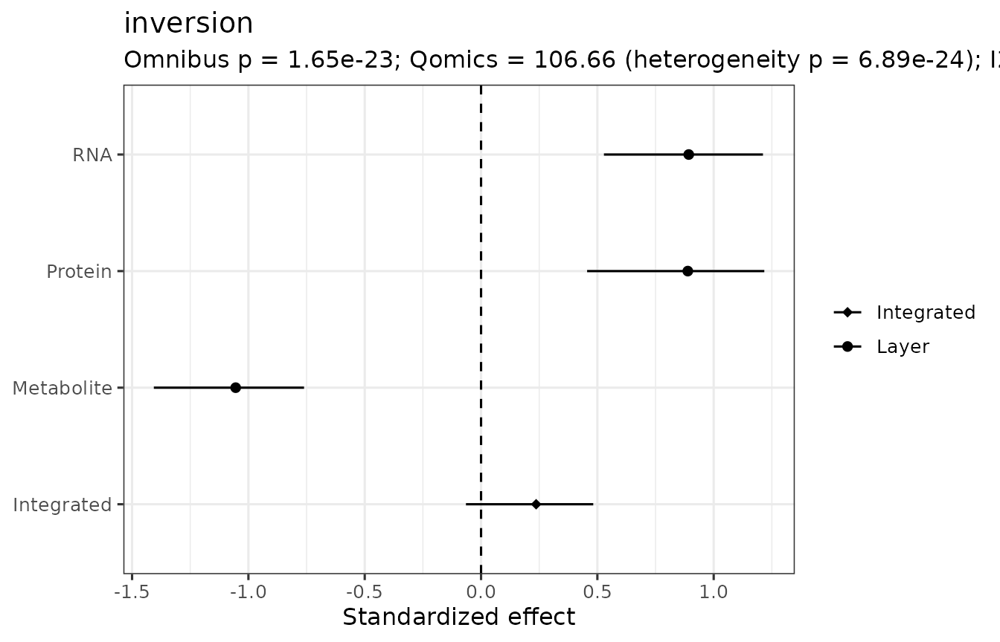
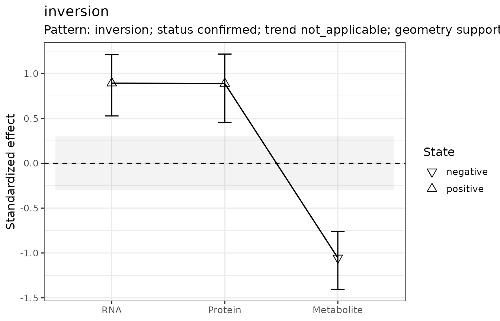

# OmicsBraid: Cross-Omics Effect Inference

## Why OmicsBraid?

Multi-omics studies frequently summarize each layer independently and
then describe RNA/protein/metabolite agreement qualitatively. OmicsBraid
makes that comparison explicit by estimating standardized effects with
uncertainty, accounting for matched-subject dependence, testing joint
multi-omic evidence, quantifying cross-layer heterogeneity, testing
practical equivalence, and evaluating ordered effect trajectories.

Version 0.2.2 retains the hierarchical inference introduced in v0.1.9,
deliberately distinguishes **absence of detected evidence** from
**evidence of practical equivalence**, and separates confirmed braid
patterns from suggestive effect geometry.

## Simulate known biology

``` r

sim <- simulate_braid_data(n_per_group = 60, rho = 0.5, seed = 42)
sim$data
#> <omics_braid_data>
#>  Samples in metadata: 120 
#>  Assays: RNA, Protein, Metabolite 
#>   - RNA: 7 features x 120 samples
#>   - Protein: 7 features x 120 samples
#>   - Metabolite: 7 features x 120 samples
```

## Run the full workflow

For a quick vignette we use fewer bootstrap and Monte Carlo replicates
than are recommended for final analyses. Both the equivalence margin and
the trajectory margin are scientific SESOIs and should be justified in a
real study.

``` r

fit <- run_omics_braid(
  sim$data,
  group = "group",
  reference = "Control",
  comparison = "Disease",
  omic_order = c("RNA", "Protein", "Metabolite"),
  bootstrap_B = 150,
  ci_method = "percentile",
  integrated_ci_method = "percentile",
  ci_min_boot = 75,
  pattern_draws = 500,
  equivalence_margin = 0.30,
  trajectory_margin = 0.15,
  seed = 42
)
fit
#> <omics_braid_result>
#>  Analysis level: feature 
#>  Entities with integrated estimates: 7 
#>  Omic order: RNA -> Protein -> Metabolite 
#>  Pattern counts:
#> 
#>            uncertain        amplification          attenuation 
#>                    2                    1                    1 
#>  concordant_increase            inversion no_detectable_effect 
#>                    1                    1                    1
```

## Layer-specific and integrated inference

``` r

fit$effects
#>           entity       omic      effect        se        var    conf_low
#> 1  concordant_up        RNA  1.00144509 0.1936803 0.03751205  0.69605800
#> 2    attenuation        RNA  1.25169392 0.1996532 0.03986141  0.89963986
#> 3  amplification        RNA  0.46226988 0.1849965 0.03422372  0.07910780
#> 4      inversion        RNA  0.89279590 0.1914537 0.03665452  0.52818957
#> 5      buffering        RNA  1.00878168 0.1938389 0.03757350  0.65713148
#> 6      emergence        RNA -0.09098272 0.1826686 0.03336782 -0.40556523
#> 7           null        RNA  0.12827860 0.1827619 0.03340190 -0.16089932
#> 8  concordant_up    Protein  0.97462689 0.1931094 0.03729124  0.66781544
#> 9    attenuation    Protein  1.05459113 0.1948521 0.03796734  0.68234571
#> 10 amplification    Protein  1.05270385 0.1948096 0.03795077  0.68844788
#> 11     inversion    Protein  0.88871683 0.1913746 0.03662424  0.45590412
#> 12     buffering    Protein  0.09028704 0.1826672 0.03336730 -0.28788651
#> 13     emergence    Protein -0.14057652 0.1827995 0.03341567 -0.50590192
#> 14          null    Protein  0.19565005 0.1830105 0.03349283 -0.08057614
#> 15 concordant_up Metabolite  0.98128400 0.1932498 0.03734549  0.65009450
#> 16   attenuation Metabolite  0.45993038 0.1849722 0.03421473  0.17618409
#> 17 amplification Metabolite  1.20804235 0.1985297 0.03941403  0.88497435
#> 18     inversion Metabolite -1.05471770 0.1948550 0.03796846 -1.40648236
#> 19     buffering Metabolite -0.09932691 0.1826867 0.03337444 -0.47128460
#> 20     emergence Metabolite  1.21540797 0.1987169 0.03948840  0.89655624
#> 21          null Metabolite -0.12112608 0.1827415 0.03339446 -0.45480952
#>     conf_high      p_value n_reference n_comparison  df reference comparison
#> 1   1.4073756 2.333318e-07          60           60 118   Control    Disease
#> 2   1.5982158 3.625814e-10          60           60 118   Control    Disease
#> 3   0.7580930 1.246137e-02          60           60 118   Control    Disease
#> 4   1.2118146 3.112587e-06          60           60 118   Control    Disease
#> 5   1.3822497 1.948043e-07          60           60 118   Control    Disease
#> 6   0.2624031 6.184310e-01          60           60 118   Control    Disease
#> 7   0.4586201 4.827482e-01          60           60 118   Control    Disease
#> 8   1.3301872 4.487557e-07          60           60 118   Control    Disease
#> 9   1.4192255 6.223270e-08          60           60 118   Control    Disease
#> 10  1.3630042 6.525893e-08          60           60 118   Control    Disease
#> 11  1.2175392 3.419598e-06          60           60 118   Control    Disease
#> 12  0.4719160 6.211150e-01          60           60 118   Control    Disease
#> 13  0.2399769 4.418814e-01          60           60 118   Control    Disease
#> 14  0.5828418 2.850404e-01          60           60 118   Control    Disease
#> 15  1.3694721 3.818296e-07          60           60 118   Control    Disease
#> 16  0.8478675 1.290127e-02          60           60 118   Control    Disease
#> 17  1.6688926 1.165303e-09          60           60 118   Control    Disease
#> 18 -0.7608886 6.203475e-08          60           60 118   Control    Disease
#> 19  0.2098740 5.866474e-01          60           60 118   Control    Disease
#> 20  1.6815974 9.578548e-10          60           60 118   Control    Disease
#> 21  0.1814331 5.074412e-01          60           60 118   Control    Disease
#>           p_adj conf_low_analytic conf_high_analytic conf_low_bootstrap
#> 1  5.444408e-07        0.62183872          1.3810515         0.69605800
#> 2  2.538070e-09        0.86038080          1.6430070         0.89963986
#> 3  1.744591e-02        0.09968331          0.8248564         0.07910780
#> 4  5.447027e-06        0.51755354          1.2680383         0.52818957
#> 5  5.444408e-07        0.62886451          1.3886989         0.65713148
#> 6  6.184310e-01       -0.44900664          0.2670412        -0.40556523
#> 7  5.632062e-01       -0.22992807          0.4864853        -0.16089932
#> 8  1.047097e-06        0.59613942          1.3531144         0.66781544
#> 9  2.284063e-07        0.67268801          1.4364942         0.68234571
#> 10 2.284063e-07        0.67088409          1.4345236         0.68844788
#> 11 5.984296e-06        0.51362949          1.2638042         0.45590412
#> 12 6.211150e-01       -0.26773406          0.4483081        -0.28788651
#> 13 5.155283e-01       -0.49885705          0.2177040        -0.50590192
#> 14 3.990566e-01       -0.16304386          0.5543440        -0.08057614
#> 15 6.682018e-07        0.60252132          1.3600467         0.65009450
#> 16 1.806178e-02        0.09739143          0.8224693         0.17618409
#> 17 4.078560e-09        0.81893136          1.5971533         0.88497435
#> 18 1.447477e-07       -1.43662641         -0.6728090        -1.40648236
#> 19 5.866474e-01       -0.45738632          0.2587325        -0.47128460
#> 20 4.078560e-09        0.82593002          1.6048859         0.89655624
#> 21 5.866474e-01       -0.47929288          0.2370407        -0.45480952
#>    conf_high_bootstrap ci_boot_n  ci_method
#> 1            1.4073756       150 percentile
#> 2            1.5982158       150 percentile
#> 3            0.7580930       150 percentile
#> 4            1.2118146       150 percentile
#> 5            1.3822497       150 percentile
#> 6            0.2624031       150 percentile
#> 7            0.4586201       150 percentile
#> 8            1.3301872       150 percentile
#> 9            1.4192255       150 percentile
#> 10           1.3630042       150 percentile
#> 11           1.2175392       150 percentile
#> 12           0.4719160       150 percentile
#> 13           0.2399769       150 percentile
#> 14           0.5828418       150 percentile
#> 15           1.3694721       150 percentile
#> 16           0.8478675       150 percentile
#> 17           1.6688926       150 percentile
#> 18          -0.7608886       150 percentile
#> 19           0.2098740       150 percentile
#> 20           1.6815974       150 percentile
#> 21           0.1814331       150 percentile
fit$integrated
#>          entity n_omics                  omics integrated_effect integrated_se
#> 1 concordant_up       3 RNA;Protein;Metabolite         0.9864109     0.1559653
#> 2   attenuation       3 RNA;Protein;Metabolite         0.8639380     0.1520348
#> 3 amplification       3 RNA;Protein;Metabolite         0.8900575     0.1401822
#> 4     inversion       3 RNA;Protein;Metabolite         0.2367999     0.1494312
#> 5     buffering       3 RNA;Protein;Metabolite         0.2017760     0.1492364
#> 6     emergence       3 RNA;Protein;Metabolite         0.2548307     0.1494271
#> 7          null       3 RNA;Protein;Metabolite         0.0725554     0.1505732
#>      conf_low conf_high   z_value      p_value  W_omnibus df_omnibus
#> 1  0.76202816 1.3108755 6.3245541 2.539649e-10  40.018617          3
#> 2  0.59632557 1.1344355 5.6825020 1.327384e-08  48.655091          3
#> 3  0.64760674 1.1528350 6.3492910 2.163095e-10  53.211244          3
#> 4 -0.06483514 0.4822842 1.5846744 1.130403e-01 109.174080          3
#> 5 -0.11416166 0.4720860 1.3520562 1.763573e-01  45.726238          3
#> 6 -0.00114991 0.5668491 1.7053849 8.812267e-02  56.750954          3
#> 7 -0.18947378 0.3501312 0.4818613 6.299045e-01   3.737902          3
#>      p_omnibus      Q_omics df_heterogeneity p_heterogeneity I2_omics
#> 1 1.055871e-08   0.01863237                2    9.907271e-01  0.00000
#> 2 1.544725e-10  16.36426276                2    2.796054e-04 87.77825
#> 3 1.652761e-11  12.89774767                2    1.582303e-03 84.49342
#> 4 1.652244e-23 106.66288721                2    6.893636e-24 98.12493
#> 5 6.484857e-10  43.89818218                2    2.935154e-10 95.44400
#> 6 2.904514e-12  53.84261679                2    2.033407e-12 96.28547
#> 7 2.911922e-01   3.50571193                2    1.732784e-01 42.95025
#>   direction_agreement min_gls_weight max_gls_weight has_negative_gls_weight
#> 1           1.0000000      0.3157307      0.3585517                   FALSE
#> 2           1.0000000      0.2648280      0.4083866                   FALSE
#> 3           1.0000000      0.3158030      0.3585545                   FALSE
#> 4           0.6745374      0.3308672      0.3361403                   FALSE
#> 5           0.6537945      0.2028120      0.4027403                   FALSE
#> 6           0.2971626      0.2789258      0.3744956                   FALSE
#> 7           0.6663153      0.3122066      0.3656074                   FALSE
#>   covariance_condition_number   covariance_mode        p_adj p_omnibus_adj
#> 1                    4.123371 matched_bootstrap 8.888771e-10  1.231850e-08
#> 2                    3.464132 matched_bootstrap 3.097229e-08  2.703268e-10
#> 3                    2.515495 matched_bootstrap 8.888771e-10  3.856442e-11
#> 4                    3.252030 matched_bootstrap 1.582564e-01  1.156571e-22
#> 5                    4.379049 matched_bootstrap 2.057502e-01  9.078800e-10
#> 6                    4.013146 matched_bootstrap 1.542147e-01  1.016580e-11
#> 7                    4.780129 matched_bootstrap 6.299045e-01  2.911922e-01
#>   p_heterogeneity_adj heterogeneity_test_flag has_omnibus_evidence_local
#> 1        9.907271e-01                   FALSE                       TRUE
#> 2        4.893094e-04                    TRUE                       TRUE
#> 3        2.215224e-03                    TRUE                       TRUE
#> 4        4.825545e-23                    TRUE                       TRUE
#> 5        6.848692e-10                    TRUE                       TRUE
#> 6        7.116925e-12                    TRUE                       TRUE
#> 7        2.021581e-01                   FALSE                      FALSE
#>   has_omnibus_evidence evidence_qualified_direction_agreement conf_low_analytic
#> 1                 TRUE                              1.0000000        0.68072458
#> 2                 TRUE                              1.0000000        0.56595528
#> 3                 TRUE                              1.0000000        0.61530545
#> 4                 TRUE                              0.6745374       -0.05607998
#> 5                 TRUE                              0.6537945       -0.09072196
#> 6                 TRUE                              0.2971626       -0.03804102
#> 7                FALSE                                     NA       -0.22256265
#>   conf_high_analytic conf_low_bootstrap conf_high_bootstrap ci_boot_n
#> 1          1.2920973         0.76202816           1.3108755       150
#> 2          1.1619207         0.59632557           1.1344355       150
#> 3          1.1648095         0.64760674           1.1528350       150
#> 4          0.5296797        -0.06483514           0.4822842       150
#> 5          0.4942740        -0.11416166           0.4720860       150
#> 6          0.5477024        -0.00114991           0.5668491       150
#> 7          0.3676735        -0.18947378           0.3501312       150
#>    ci_method
#> 1 percentile
#> 2 percentile
#> 3 percentile
#> 4 percentile
#> 5 percentile
#> 6 percentile
#> 7 percentile
fit$equivalence
#>           entity       omic      effect        se        var    conf_low
#> 1  concordant_up        RNA  1.00144509 0.1936803 0.03751205  0.69605800
#> 2    attenuation        RNA  1.25169392 0.1996532 0.03986141  0.89963986
#> 3  amplification        RNA  0.46226988 0.1849965 0.03422372  0.07910780
#> 4      inversion        RNA  0.89279590 0.1914537 0.03665452  0.52818957
#> 5      buffering        RNA  1.00878168 0.1938389 0.03757350  0.65713148
#> 6      emergence        RNA -0.09098272 0.1826686 0.03336782 -0.40556523
#> 7           null        RNA  0.12827860 0.1827619 0.03340190 -0.16089932
#> 8  concordant_up    Protein  0.97462689 0.1931094 0.03729124  0.66781544
#> 9    attenuation    Protein  1.05459113 0.1948521 0.03796734  0.68234571
#> 10 amplification    Protein  1.05270385 0.1948096 0.03795077  0.68844788
#> 11     inversion    Protein  0.88871683 0.1913746 0.03662424  0.45590412
#> 12     buffering    Protein  0.09028704 0.1826672 0.03336730 -0.28788651
#> 13     emergence    Protein -0.14057652 0.1827995 0.03341567 -0.50590192
#> 14          null    Protein  0.19565005 0.1830105 0.03349283 -0.08057614
#> 15 concordant_up Metabolite  0.98128400 0.1932498 0.03734549  0.65009450
#> 16   attenuation Metabolite  0.45993038 0.1849722 0.03421473  0.17618409
#> 17 amplification Metabolite  1.20804235 0.1985297 0.03941403  0.88497435
#> 18     inversion Metabolite -1.05471770 0.1948550 0.03796846 -1.40648236
#> 19     buffering Metabolite -0.09932691 0.1826867 0.03337444 -0.47128460
#> 20     emergence Metabolite  1.21540797 0.1987169 0.03948840  0.89655624
#> 21          null Metabolite -0.12112608 0.1827415 0.03339446 -0.45480952
#>     conf_high      p_value n_reference n_comparison  df reference comparison
#> 1   1.4073756 2.333318e-07          60           60 118   Control    Disease
#> 2   1.5982158 3.625814e-10          60           60 118   Control    Disease
#> 3   0.7580930 1.246137e-02          60           60 118   Control    Disease
#> 4   1.2118146 3.112587e-06          60           60 118   Control    Disease
#> 5   1.3822497 1.948043e-07          60           60 118   Control    Disease
#> 6   0.2624031 6.184310e-01          60           60 118   Control    Disease
#> 7   0.4586201 4.827482e-01          60           60 118   Control    Disease
#> 8   1.3301872 4.487557e-07          60           60 118   Control    Disease
#> 9   1.4192255 6.223270e-08          60           60 118   Control    Disease
#> 10  1.3630042 6.525893e-08          60           60 118   Control    Disease
#> 11  1.2175392 3.419598e-06          60           60 118   Control    Disease
#> 12  0.4719160 6.211150e-01          60           60 118   Control    Disease
#> 13  0.2399769 4.418814e-01          60           60 118   Control    Disease
#> 14  0.5828418 2.850404e-01          60           60 118   Control    Disease
#> 15  1.3694721 3.818296e-07          60           60 118   Control    Disease
#> 16  0.8478675 1.290127e-02          60           60 118   Control    Disease
#> 17  1.6688926 1.165303e-09          60           60 118   Control    Disease
#> 18 -0.7608886 6.203475e-08          60           60 118   Control    Disease
#> 19  0.2098740 5.866474e-01          60           60 118   Control    Disease
#> 20  1.6815974 9.578548e-10          60           60 118   Control    Disease
#> 21  0.1814331 5.074412e-01          60           60 118   Control    Disease
#>           p_adj conf_low_analytic conf_high_analytic conf_low_bootstrap
#> 1  5.444408e-07        0.62183872          1.3810515         0.69605800
#> 2  2.538070e-09        0.86038080          1.6430070         0.89963986
#> 3  1.744591e-02        0.09968331          0.8248564         0.07910780
#> 4  5.447027e-06        0.51755354          1.2680383         0.52818957
#> 5  5.444408e-07        0.62886451          1.3886989         0.65713148
#> 6  6.184310e-01       -0.44900664          0.2670412        -0.40556523
#> 7  5.632062e-01       -0.22992807          0.4864853        -0.16089932
#> 8  1.047097e-06        0.59613942          1.3531144         0.66781544
#> 9  2.284063e-07        0.67268801          1.4364942         0.68234571
#> 10 2.284063e-07        0.67088409          1.4345236         0.68844788
#> 11 5.984296e-06        0.51362949          1.2638042         0.45590412
#> 12 6.211150e-01       -0.26773406          0.4483081        -0.28788651
#> 13 5.155283e-01       -0.49885705          0.2177040        -0.50590192
#> 14 3.990566e-01       -0.16304386          0.5543440        -0.08057614
#> 15 6.682018e-07        0.60252132          1.3600467         0.65009450
#> 16 1.806178e-02        0.09739143          0.8224693         0.17618409
#> 17 4.078560e-09        0.81893136          1.5971533         0.88497435
#> 18 1.447477e-07       -1.43662641         -0.6728090        -1.40648236
#> 19 5.866474e-01       -0.45738632          0.2587325        -0.47128460
#> 20 4.078560e-09        0.82593002          1.6048859         0.89655624
#> 21 5.866474e-01       -0.47929288          0.2370407        -0.45480952
#>    conf_high_bootstrap ci_boot_n  ci_method equiv_margin p_tost_lower
#> 1            1.4073756       150 percentile          0.3 9.114086e-12
#> 2            1.5982158       150 percentile          0.3 3.864486e-15
#> 3            0.7580930       150 percentile          0.3 1.890628e-05
#> 4            1.2118146       150 percentile          0.3 2.329118e-10
#> 5            1.3822497       150 percentile          0.3 7.295784e-12
#> 6            0.2624031       150 percentile          0.3 1.262615e-01
#> 7            0.4586201       150 percentile          0.3 9.555219e-03
#> 8            1.3301872       150 percentile          0.3 2.048273e-11
#> 9            1.4192255       150 percentile          0.3 1.802075e-12
#> 10           1.3630042       150 percentile          0.3 1.909489e-12
#> 11           1.2175392       150 percentile          0.3 2.624630e-10
#> 12           0.4719160       150 percentile          0.3 1.631519e-02
#> 13           0.2399769       150 percentile          0.3 1.915710e-01
#> 14           0.5828418       150 percentile          0.3 3.381286e-03
#> 15           1.3694721       150 percentile          0.3 1.676218e-11
#> 16           0.8478675       150 percentile          0.3 1.992496e-05
#> 17           1.6688926       150 percentile          0.3 1.526467e-14
#> 18          -0.7608886       150 percentile          0.3 9.999463e-01
#> 19           0.2098740       150 percentile          0.3 1.360030e-01
#> 20           1.6815974       150 percentile          0.3 1.211081e-14
#> 21           0.1814331       150 percentile          0.3 1.638306e-01
#>    p_tost_upper    p_tost p_tost_adj p_difference p_difference_adj
#> 1  9.998536e-01 0.9998536  0.9999991 2.333318e-07     5.444408e-07
#> 2  9.999991e-01 0.9999991  0.9999991 3.625814e-10     2.538070e-09
#> 3  8.097976e-01 0.8097976  0.9999991 1.246137e-02     1.744591e-02
#> 4  9.990202e-01 0.9990202  0.9999991 3.112587e-06     5.447027e-06
#> 5  9.998722e-01 0.9998722  0.9999991 1.948043e-07     5.444408e-07
#> 6  1.616149e-02 0.1262615  0.6079979 6.184310e-01     6.184310e-01
#> 7  1.737137e-01 0.1737137  0.6079979 4.827482e-01     5.632062e-01
#> 8  9.997616e-01 0.9997616  0.9999462 4.487557e-07     1.047097e-06
#> 9  9.999462e-01 0.9999462  0.9999462 6.223270e-08     2.284063e-07
#> 10 9.999442e-01 0.9999442  0.9999462 6.525893e-08     2.284063e-07
#> 11 9.989519e-01 0.9989519  0.9999462 3.419598e-06     5.984296e-06
#> 12 1.254718e-01 0.1254718  0.6633104 6.211150e-01     6.211150e-01
#> 13 7.972719e-03 0.1915710  0.6633104 4.418814e-01     5.155283e-01
#> 14 2.842759e-01 0.2842759  0.6633104 2.850404e-01     3.990566e-01
#> 15 9.997886e-01 0.9997886  0.9999980 3.818296e-07     6.682018e-07
#> 16 8.063758e-01 0.8063758  0.9999980 1.290127e-02     1.806178e-02
#> 17 9.999976e-01 0.9999976  0.9999980 1.165303e-09     4.078560e-09
#> 18 1.795090e-12 0.9999463  0.9999980 6.203475e-08     1.447477e-07
#> 19 1.441307e-02 0.1360030  0.5734071 5.866474e-01     5.866474e-01
#> 20 9.999980e-01 0.9999980  0.9999980 9.578548e-10     4.078560e-09
#> 21 1.059757e-02 0.1638306  0.5734071 5.074412e-01     5.866474e-01
#>    equivalent_local equivalent_adjusted state_local state_adjusted equivalent
#> 1             FALSE               FALSE    positive       positive      FALSE
#> 2             FALSE               FALSE    positive       positive      FALSE
#> 3             FALSE               FALSE    positive       positive      FALSE
#> 4             FALSE               FALSE    positive       positive      FALSE
#> 5             FALSE               FALSE    positive       positive      FALSE
#> 6             FALSE               FALSE   uncertain      uncertain      FALSE
#> 7             FALSE               FALSE   uncertain      uncertain      FALSE
#> 8             FALSE               FALSE    positive       positive      FALSE
#> 9             FALSE               FALSE    positive       positive      FALSE
#> 10            FALSE               FALSE    positive       positive      FALSE
#> 11            FALSE               FALSE    positive       positive      FALSE
#> 12            FALSE               FALSE   uncertain      uncertain      FALSE
#> 13            FALSE               FALSE   uncertain      uncertain      FALSE
#> 14            FALSE               FALSE   uncertain      uncertain      FALSE
#> 15            FALSE               FALSE    positive       positive      FALSE
#> 16            FALSE               FALSE    positive       positive      FALSE
#> 17            FALSE               FALSE    positive       positive      FALSE
#> 18            FALSE               FALSE    negative       negative      FALSE
#> 19            FALSE               FALSE   uncertain      uncertain      FALSE
#> 20            FALSE               FALSE    positive       positive      FALSE
#> 21            FALSE               FALSE   uncertain      uncertain      FALSE
#>        state state_basis
#> 1   positive       local
#> 2   positive       local
#> 3   positive       local
#> 4   positive       local
#> 5   positive       local
#> 6  uncertain       local
#> 7  uncertain       local
#> 8   positive       local
#> 9   positive       local
#> 10  positive       local
#> 11  positive       local
#> 12 uncertain       local
#> 13 uncertain       local
#> 14 uncertain       local
#> 15  positive       local
#> 16  positive       local
#> 17  positive       local
#> 18  negative       local
#> 19 uncertain       local
#> 20  positive       local
#> 21 uncertain       local
fit$trend
#>          entity n_layers_trend            trend_omics aligned_direction
#> 1 concordant_up              3 RNA;Protein;Metabolite                 1
#> 2   attenuation              3 RNA;Protein;Metabolite                 1
#> 3 amplification              3 RNA;Protein;Metabolite                 1
#> 4     inversion              3 RNA;Protein;Metabolite                 1
#> 5     buffering              3 RNA;Protein;Metabolite                 1
#> 6     emergence              3 RNA;Protein;Metabolite                 1
#> 7          null              3 RNA;Protein;Metabolite                 1
#>   same_sign_estimates trend_intercept  trend_slope trend_slope_se
#> 1                TRUE       0.9954493 -0.009345233     0.10157657
#> 2                TRUE       1.3152377 -0.394645063     0.10143190
#> 3                TRUE       0.5212506  0.385278032     0.11249942
#> 4               FALSE       1.1802529 -0.938504303     0.10668915
#> 5               FALSE       0.8821600 -0.570966455     0.09098996
#> 6               FALSE      -0.3017976  0.597018242     0.09862480
#> 7               FALSE       0.1971335 -0.123347212     0.08445347
#>   trend_conf_low trend_conf_high p_trend_zero p_meaningful_amplification
#> 1     -0.2084317      0.18974119 9.266966e-01               9.416434e-01
#> 2     -0.5934479     -0.19584218 9.993941e-05               1.000000e+00
#> 3      0.1647832      0.60577285 6.154532e-04               1.824741e-02
#> 4     -1.1476112     -0.72939742 1.409938e-18               1.000000e+00
#> 5     -0.7493035     -0.39262941 3.495243e-10               1.000000e+00
#> 6      0.4037172      0.79031930 1.417946e-09               2.914298e-06
#> 7     -0.2888730      0.04217855 1.441432e-01               9.993953e-01
#>   p_meaningful_attenuation p_flat_tost trajectory_margin covariance_mode_trend
#> 1             9.169304e-01  0.08306957              0.15     matched_bootstrap
#> 2             7.934505e-03  0.99206549              0.15     matched_bootstrap
#> 3             9.999990e-01  0.98175259              0.15     matched_bootstrap
#> 4             7.304525e-14  1.00000000              0.15     matched_bootstrap
#> 5             1.859346e-06  0.99999814              0.15     matched_bootstrap
#> 6             1.000000e+00  0.99999709              0.15     matched_bootstrap
#> 7             6.238437e-01  0.37615634              0.15     matched_bootstrap
#>   trend_state_local p_meaningful_amplification_adj p_meaningful_attenuation_adj
#> 1         uncertain                   1.000000e+00                 1.000000e+00
#> 2       attenuation                   1.000000e+00                 1.851385e-02
#> 3     amplification                   6.386593e-02                 1.000000e+00
#> 4    not_applicable                   1.000000e+00                 5.113167e-13
#> 5    not_applicable                   1.000000e+00                 6.507711e-06
#> 6    not_applicable                   2.040009e-05                 1.000000e+00
#> 7    not_applicable                   1.000000e+00                 1.000000e+00
#>   p_flat_tost_adj trend_state_adjusted
#> 1        0.581487            uncertain
#> 2        1.000000          attenuation
#> 3        1.000000            uncertain
#> 4        1.000000       not_applicable
#> 5        1.000000       not_applicable
#> 6        1.000000       not_applicable
#> 7        1.000000       not_applicable
fit$classification
#>          entity              pattern      pattern_status  suggestive_pattern
#> 1 concordant_up  concordant_increase direction_confirmed concordant_increase
#> 2   attenuation          attenuation           confirmed         attenuation
#> 3 amplification        amplification           confirmed       amplification
#> 4     inversion            inversion           confirmed           inversion
#> 5     buffering            uncertain          unresolved           buffering
#> 6     emergence            uncertain          unresolved           emergence
#> 7          null no_detectable_effect         no_evidence     null_equivalent
#>                                                         interpretation_label
#> 1 concordant_increase (trajectory unresolved; geometry: concordant_increase)
#> 2                                                                attenuation
#> 3                                                              amplification
#> 4                                                                  inversion
#> 5                                                       suggestive_buffering
#> 6                                                       suggestive_emergence
#> 7                           no_detectable_effect (geometry: null_equivalent)
#>                                                              confirmatory_basis
#> 1 all observed layers support one direction; magnitude trajectory is unresolved
#> 2                 same-direction layers plus meaningful negative GLS trajectory
#> 3                 same-direction layers plus meaningful positive GLS trajectory
#> 4                  statistically supported effects occur in opposite directions
#> 5 partial or transient layer pattern does not satisfy a confirmatory braid rule
#> 6 partial or transient layer pattern does not satisfy a confirmatory braid rule
#> 7             joint-null omnibus test not rejected; equivalence not established
#>   n_layers_observed n_positive n_negative n_equivalent n_uncertain
#> 1                 3          3          0            0           0
#> 2                 3          3          0            0           0
#> 3                 3          3          0            0           0
#> 4                 3          2          1            0           0
#> 5                 3          1          0            0           2
#> 6                 3          1          0            0           2
#> 7                 3          0          0            0           3
#>   omnibus_p_local omnibus_evidence_local  trend_slope trend_slope_se
#> 1    1.055871e-08                   TRUE -0.009345233     0.10157657
#> 2    1.544725e-10                   TRUE -0.394645063     0.10143190
#> 3    1.652761e-11                   TRUE  0.385278032     0.11249942
#> 4    1.652244e-23                   TRUE -0.938504303     0.10668915
#> 5    6.484857e-10                   TRUE -0.570966455     0.09098996
#> 6    2.904514e-12                   TRUE  0.597018242     0.09862480
#> 7    2.911922e-01                  FALSE -0.123347212     0.08445347
#>   trend_conf_low trend_conf_high p_trend_zero p_meaningful_amplification
#> 1     -0.2084317      0.18974119 9.266966e-01               9.416434e-01
#> 2     -0.5934479     -0.19584218 9.993941e-05               1.000000e+00
#> 3      0.1647832      0.60577285 6.154532e-04               1.824741e-02
#> 4     -1.1476112     -0.72939742 1.409938e-18               1.000000e+00
#> 5     -0.7493035     -0.39262941 3.495243e-10               1.000000e+00
#> 6      0.4037172      0.79031930 1.417946e-09               2.914298e-06
#> 7     -0.2888730      0.04217855 1.441432e-01               9.993953e-01
#>   p_meaningful_attenuation p_flat_tost trajectory_margin trend_state_local
#> 1             9.169304e-01  0.08306957              0.15         uncertain
#> 2             7.934505e-03  0.99206549              0.15       attenuation
#> 3             9.999990e-01  0.98175259              0.15     amplification
#> 4             7.304525e-14  1.00000000              0.15    not_applicable
#> 5             1.859346e-06  0.99999814              0.15    not_applicable
#> 6             1.000000e+00  0.99999709              0.15    not_applicable
#> 7             6.238437e-01  0.37615634              0.15    not_applicable
#>   p_meaningful_amplification_adj p_meaningful_attenuation_adj p_flat_tost_adj
#> 1                   1.000000e+00                 1.000000e+00        0.581487
#> 2                   1.000000e+00                 1.851385e-02        1.000000
#> 3                   6.386593e-02                 1.000000e+00        1.000000
#> 4                   1.000000e+00                 5.113167e-13        1.000000
#> 5                   1.000000e+00                 6.507711e-06        1.000000
#> 6                   2.040009e-05                 1.000000e+00        1.000000
#> 7                   1.000000e+00                 1.000000e+00        1.000000
#>   trend_state_adjusted covariance_mode_trend uncertainty_mode_pattern
#> 1            uncertain     matched_bootstrap      concordant_increase
#> 2          attenuation     matched_bootstrap              attenuation
#> 3            uncertain     matched_bootstrap            amplification
#> 4       not_applicable     matched_bootstrap                inversion
#> 5       not_applicable     matched_bootstrap                buffering
#> 6       not_applicable     matched_bootstrap                emergence
#> 7       not_applicable     matched_bootstrap          null_equivalent
#>   uncertainty_mode_support deterministic_pattern_support
#> 1                    0.848                         0.848
#> 2                    0.800                         0.800
#> 3                    0.812                         0.812
#> 4                    1.000                         1.000
#> 5                    0.830                            NA
#> 6                    0.722                            NA
#> 7                    0.522                            NA
#>   suggestive_pattern_support pattern_entropy mode_agrees_with_deterministic
#> 1                      0.848       0.4741966                           TRUE
#> 2                      0.800       0.7219281                           TRUE
#> 3                      0.812       0.4939400                           TRUE
#> 4                      1.000       0.0000000                           TRUE
#> 5                      0.830       0.4710142                             NA
#> 6                      0.722       0.6166020                             NA
#> 7                      0.522       0.5657668                             NA
#>   classification_stability
#> 1           direction_high
#> 2                     high
#> 3                     high
#> 4                     high
#> 5               unresolved
#> 6               unresolved
#> 7             geometry_low
```

The integrated table separates the multivariate all-zero omnibus test
from the GLS consensus effect. This is important when opposite layer
effects cancel in the consensus.

## Robust interval reporting

Version 0.2.2 can display matched subject-bootstrap intervals without
changing the analytic SE/p-value inferential machinery. `fit$effects`
and `fit$integrated` retain analytic interval columns alongside the
selected percentile bootstrap intervals, while `fit$effect_intervals`
and `fit$consensus_intervals` contain bootstrap diagnostics. BCa layer
intervals are available for targeted/prefiltered analyses through
`bootstrap_effect_intervals(..., method = "bca")`.

``` r

head(fit$effect_intervals)
#>          entity omic  ci_method conf_level boot_n   boot_mean   boot_sd
#> 1 concordant_up  RNA percentile       0.95    150  1.04582890 0.1905216
#> 2   attenuation  RNA percentile       0.95    150  1.26372747 0.1734969
#> 3 amplification  RNA percentile       0.95    150  0.47158553 0.1754207
#> 4     inversion  RNA percentile       0.95    150  0.84723275 0.1843416
#> 5     buffering  RNA percentile       0.95    150  1.00721498 0.1946918
#> 6     emergence  RNA percentile       0.95    150 -0.08981906 0.1894424
#>      boot_bias conf_low_boot conf_high_boot bca_z0 bca_acceleration
#> 1  0.044383809     0.6960580      1.4073756     NA               NA
#> 2  0.012033557     0.8996399      1.5982158     NA               NA
#> 3  0.009315653     0.0791078      0.7580930     NA               NA
#> 4 -0.045563150     0.5281896      1.2118146     NA               NA
#> 5 -0.001566704     0.6571315      1.3822497     NA               NA
#> 6  0.001163659    -0.4055652      0.2624031     NA               NA
#>   bca_prob_low bca_prob_high
#> 1        0.025         0.975
#> 2        0.025         0.975
#> 3        0.025         0.975
#> 4        0.025         0.975
#> 5        0.025         0.975
#> 6        0.025         0.975
head(fit$consensus_intervals)
#>          entity  ci_method conf_level boot_n boot_mean   boot_sd    boot_bias
#> 1 concordant_up percentile       0.95    150 1.0228558 0.1527612  0.036444855
#> 2   attenuation percentile       0.95    150 0.8790283 0.1442353  0.015090364
#> 3 amplification percentile       0.95    150 0.9095808 0.1315381  0.019523289
#> 4     inversion percentile       0.95    150 0.2083199 0.1455697 -0.028479919
#> 5     buffering percentile       0.95    150 0.2080203 0.1559036  0.006244268
#> 6     emergence percentile       0.95    150 0.2576351 0.1560624  0.002804395
#>   conf_low_boot conf_high_boot
#> 1    0.76202816      1.3108755
#> 2    0.59632557      1.1344355
#> 3    0.64760674      1.1528350
#> 4   -0.06483514      0.4822842
#> 5   -0.11416166      0.4720860
#> 6   -0.00114991      0.5668491
```

## Ordered GLS trend test

`fit$trend` reports a covariance-aware slope over the prespecified omic
order. For same-direction layer effects, OmicsBraid only calls
attenuation or amplification when the slope exceeds the user-specified
practical trajectory margin with inferential support. Otherwise the
broader concordant direction can be retained with
`pattern_status = "direction_confirmed"`.

## Null-like outcomes

`null_equivalent` means all observed layers passed practical-equivalence
testing. `no_detectable_effect` means the joint-null omnibus test was
not rejected, but the data were not precise enough to establish
equivalence. These are different scientific conclusions.

## Evidence Forest

``` r

plot_evidence_forest(fit, "inversion")
```



## Effect Braid

``` r

plot_effect_braid(fit, "inversion")
```



## Interpretation

A significant `Q_omics` indicates that the effect vector is poorly
summarized by a single common effect after accounting for estimated
sampling covariance. The I2-like index is descriptive and has no
universal low/moderate/high cutoffs in this development version.

Braid order is descriptive/inferential, not causal. A pattern such as
`inversion` describes supported effects across a prespecified layer
order; it does not prove molecular propagation. Likewise,
`suggestive_pattern` describes effect geometry when confirmatory
precision is insufficient and must not be reported as a confirmed
result.
